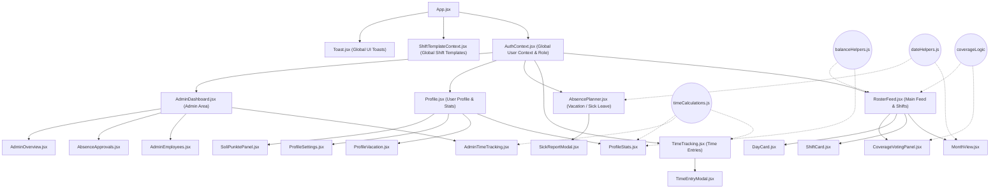
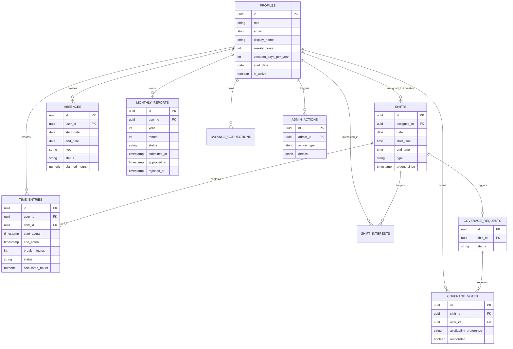
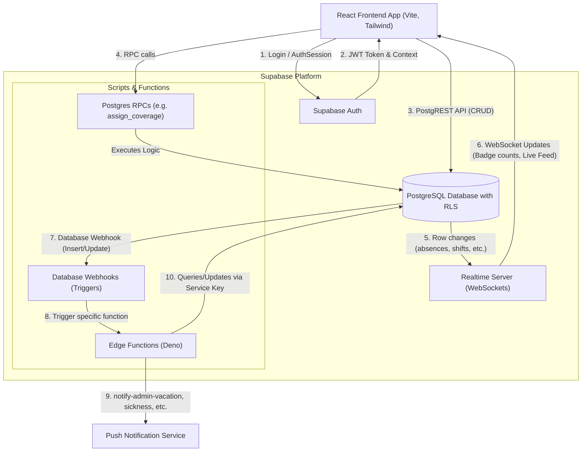

# Architecture Documentation: Dienstplan-App

Diese Datei dient als zentrale technische Dokumentation und Orientierungshilfe für die Architektur der Dienstplan-App (React, Vite, Supabase). Sie bietet einen Überblick über das State Management, die Datenbankstruktur und die Datenflüsse zwischen Frontend und Backend.

## 1. Component-Tree & State Management

Dieses Diagramm veranschaulicht die Hierarchie der wichtigsten React-Komponenten und das globale State-Management. Es zeigt, wie Daten (wie der User-Context oder Schicht-Templates) über die Context-API in die Anwendung fließen und welche zentralen Utility-Funktionen von den Komponenten genutzt werden.

## 2. Entity-Relationship-Diagramm

Das Entity-Relationship-Diagramm (ERD) modelliert die Struktur der Supabase PostgreSQL-Datenbank. Es dokumentiert alle relevanten Tabellen, deren Hauptspalten sowie die Kardinalitäten und Fremdschlüsselbeziehungen (z.B. zwischen Profilen, Schichten und Zeiten), die für die RLS-Policies und Geschäftslogik essenziell sind.

## 3. Datenfluss & Backend-Interaktionen

Dieses Flussdiagramm demonstriert die Interaktion zwischen dem React-Frontend und der Supabase-Infrastruktur. Es visualisiert den Weg von Authentifizierung und direkten CRUD-Operationen (PostgREST) über Realtime-WebSockets bis hin zur Ausführung von serverseitiger Logik durch RPCs und Edge Functions.

