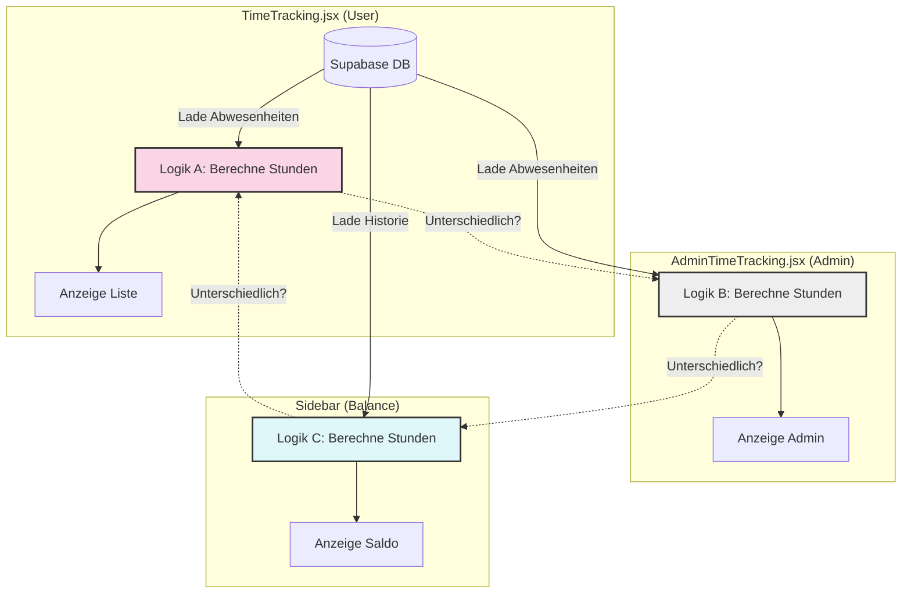
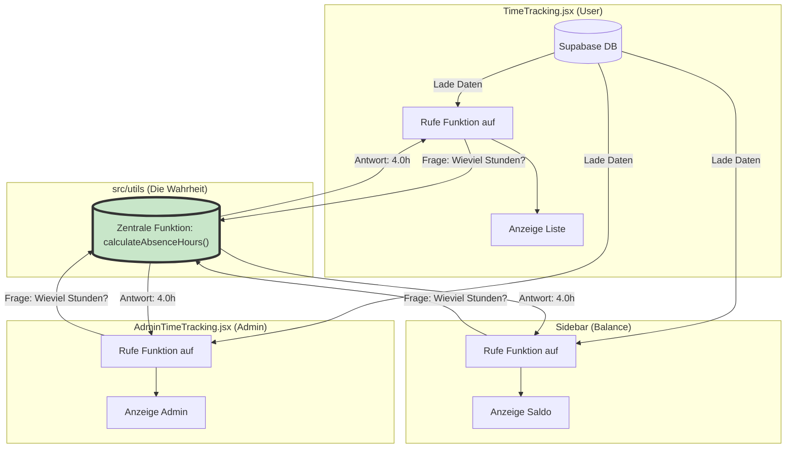

# Architektur-Schema: Datenfluss & Synchronisation

Dieses Dokument verdeutlicht, warum es aktuell zu Inkonsistenzen kommt und wie der vorgeschlagene "Single Source of Truth" (SSOT) Ansatz dies löst.

## 1. Status Quo: Das "Insel-Problem" (Aktuell)

Aktuell entscheidet jede Komponente selbst, wie viel Stunden ein Abwesenheitstag "wert" ist. Es gibt keine zentrale Autorität. Wenn wir die Logik an einer Stelle ändern (z.B. "Krank am Wochenende zählt 0"), wissen die anderen Stellen nichts davon.

### Das Problem im Detail:
*   **Logik A** (User) prüft vielleicht: *Ist heute Feiertag?*
*   **Logik B** (Admin) prüft vielleicht: *Ist heute Feiertag UND war eine Schicht geplant?*
*   **Logik C** (Balance) prüft vielleicht nur: *Ist heute Wochenende?*

Da diese Prüfungen fest im Code der jeweiligen Datei stehen ("Hardcoded"), laufen sie zwangsläufig auseinander, sobald wir an einer Datei etwas ändern.

---

## 2. Ziel-Zustand: Single Source of Truth (Lösung)

Wir ziehen die Entscheidungs-Logik aus den Komponenten heraus und legen sie in **eine zentrale Funktion** (die "Wahrheit"). Die Komponenten werden "dumm" – sie fragen nur noch die Zentrale: "Hier ist ein Tag, wie viele Stunden ist der wert?"

### Die Vorteile:
1.  **Garantierte Konsistenz:** Wenn wir in der zentralen Funktion ändern, dass "Krank am Sonntag" zählt, ändert sich das *sofort* für User, Admin und in der Saldo-Anzeige gleichzeitig.
2.  **Weniger Code:** Wir löschen hunderte Zeilen redundanten Codes aus den Komponenten.
3.  **Leichtere Fehlersuche:** Wenn die Stunden falsch sind, müssen wir nur an *einem* Ort (der `src/utils` Datei) suchen.

---

## 3. Die neue Funktion: `calculateDailyAbsenceHours`

So wird die neue "Super-Funktion" aussehen (schematisch):

**Input (Was die Funktion braucht):**
*   `date`: Der Tag, um den es geht (z.B. "2025-12-10")
*   `absenceType`: "Krank", "Urlaub", "Zeitausgleich"
*   `userProfile`: Um die Soll-Stunden zu kennen (z.B. 20h Woche -> 4h Tagesschnitt)
*   `plannedShifts`: Liste der Schichten, die für diesen Tag geplant waren (wichtig für Krank-Berechnung)

**Logik (Was die Funktion tut):**
1.  **Ist es Urlaub?**
    *   Wenn Wochenende oder Feiertag -> **0h**
    *   Sonst -> **Durchschnittswert** (z.B. 4h)
2.  **Ist es Krank?**
    *   War eine Schicht geplant?
        *   Ja -> Nimm die Dauer der geplanten Schicht (z.B. 8.5h)
        *   Nein -> Ist es ein Werktag?
            *   Ja -> Nimm **Durchschnittswert** (z.B. 4h) [Fallback]
            *   Nein -> **0h**

**Output:**
*   Die genaue Stundenanzahl (z.B. `8.5` oder `4.0` oder `0`).

---

## Nächste Schritte zur Umsetzung

1.  **Erstellen** der Funktion in `src/utils/timeCalculations.js`.
2.  **Refactoring TimeTracking.jsx**: Ersetzen der Inline-Logik durch den Funktionsaufruf.
3.  **Refactoring AdminTimeTracking.jsx**: Ersetzen der Inline-Logik durch den Funktionsaufruf.
4.  **Refactoring balanceHelpers.js**: Ersetzen der Inline-Logik durch den Funktionsaufruf.
