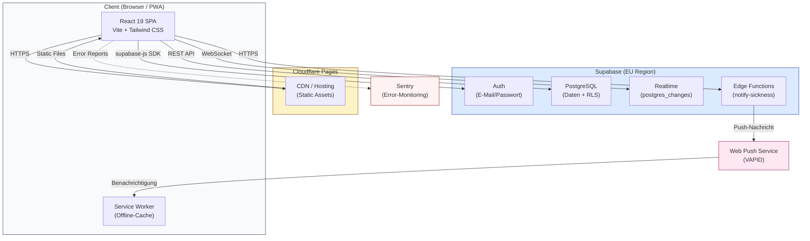

# 1 Systemübersicht

## 1.1 Projektziel und Kontext

Der **WoBePlaner** ist eine interne Workforce-Management-Anwendung für ein Sozialdienstleistungsteam mit 11 Mitarbeitern in Innsbruck, Österreich. Die Anwendung ist nicht öffentlich zugänglich und hat keine externen Nutzer.

**Kernfunktionen:**

- Dienstplanung (Schichtzuweisung, Interessensbekundung, Einspring-/Soli-System)
- Zeiterfassung (IST-Stunden, Bereitschaftszeiten, Überstundenberechnung)
- Abwesenheitsverwaltung (Urlaub, Krankmeldungen, Zeitausgleich)
- Monatsabschlüsse mit SHA-256-Integritätsprüfung und PDF-Export

**Technologie-Stack:**

| Schicht | Technologie | Version |
|---------|-------------|---------|
| Frontend-Framework | React | 19.x |
| Build-Tool | Vite | 7.x |
| CSS | Tailwind CSS | 4.x |
| Backend-as-a-Service | Supabase (PostgreSQL + Auth + Realtime + Edge Functions) | supabase-js 2.x |
| Icons | Lucide React | 0.577.x |
| Routing | React Router DOM | 7.x |
| PDF-Erzeugung | jsPDF | 4.x |
| Error-Monitoring | Sentry (React SDK) | 10.x |
| Datumslogik | date-fns | 4.x |
| PWA | vite-plugin-pwa | 1.x |

Die gesamte Geschäftslogik läuft clientseitig. Es gibt kein eigenes Backend -- alle Datenbankoperationen, Authentifizierung und Echtzeit-Synchronisierung laufen über Supabase.

---

## 1.2 Benutzerrollen

Das System kennt genau zwei Rollen, gespeichert in `profiles.role`:

### Admin

- Vollzugriff auf alle Funktionen
- Dienstplan erstellen und bearbeiten (Schichten anlegen, zuweisen, löschen)
- Zeiterfassung aller Mitarbeiter einsehen und korrigieren (`AdminTimeTracking`)
- Abwesenheitsanträge genehmigen oder ablehnen
- Mitarbeiter verwalten (anlegen, deaktivieren, Rollen ändern)
- Monatsabschlüsse durchführen und entsperren
- Einspring-System: Krankmeldungen erfassen, Coverage-Zuweisung auflösen
- Audit-Log einsehen
- Sieht den Admin-Tab in der Navigation (mit Badge-Count für offene Anträge und dringende Schichten)
- Sieht bei privaten Diensttypen (z.B. Mitarbeitergespräch) alle Teilnehmer

### Employee (Mitarbeiter)

- Dienstplan der aktuellen und kommenden Wochen ansehen
- Interesse an offenen Schichten bekunden (`shift_interest`)
- Eigene Zeiten erfassen und einsehen (`TimeTracking`)
- Urlaub und Zeitausgleich beantragen
- An Einspring-Abstimmungen teilnehmen (Coverage-Voting: verfügbar / ungern / nur Notfall)
- Eigenes Profil verwalten (Passwort, Benachrichtigungen)
- Sieht bei privaten Diensttypen nur eigene Einträge

**Erstanmeldung:** Neue Benutzer (`profiles.password_set = false`) werden auf eine Passwort-Einrichtungsseite (`SetPassword`) geleitet, bevor sie Zugriff auf die App erhalten.

---

## 1.3 Navigationsstruktur

Die App verwendet eine Tab-basierte Navigation mit 5 Bereichen. Der aktive Tab wird als State im Root-Component (`App.jsx`) verwaltet.

| Tab-ID | Label | Icon | Sichtbarkeit | Komponente |
|--------|-------|------|--------------|------------|
| `roster` | Dienstplan | Calendar | Alle | `RosterFeed` |
| `times` | Zeiten | List | Alle | Admin: `AdminTimeTracking`, Employee: `TimeTracking` |
| `absences` | Urlaub | Plane | Alle | `AbsencePlanner` |
| `admin` | Admin | Shield | Nur Admin | `AdminDashboard` |
| `profile` | Profil | User | Alle | `Profile` |

### Rendering-Varianten

- **Mobile (< 1024px):** Bottom-Navigation (`BottomNav`), fixiert am unteren Bildschirmrand. Glasmorphism-Stil (`bg-white/80 backdrop-blur-xl`). Safe-Area-Padding für Geräte mit Home-Indikator.
- **Desktop (>= 1024px):** Seitenleiste links (`Sidebar`), 256px breit, mit Logo oben und Versionsnummer unten. Aktiver Tab hervorgehoben in Teal (`#00C2CB`).

### Badges

Auf den Navigations-Tabs werden Badges angezeigt:

| Tab | Badge-Typ | Bedingung | Sichtbarkeit |
|-----|-----------|-----------|--------------|
| `admin` | Zähler (rot) | Anzahl offener Abwesenheitsanträge (`status = 'beantragt'`) + dringende Schichten (`urgent_since IS NOT NULL`) | Nur Admin |
| `roster` | Punkt (rot) | Mindestens eine dringende Schicht existiert | Nur Admin |

Die Badge-Daten werden initial geladen und über Supabase Realtime bei Änderungen an `absences`, `shifts` und `coverage_requests` automatisch aktualisiert (debounced, 1 Sekunde).

### Coverage-Alert-Banner

Für Employees wird ein roter, pulsierender Banner über allen Tabs angezeigt, wenn offene Einspring-Abstimmungen (`coverage_votes.responded = false` mit `coverage_requests.status = 'open'`) existieren. Ein Klick navigiert zum Roster-Tab und scrollt zur Abstimmungssektion.

### Lazy Loading

Die Tabs `absences`, `profile`, `admin` und `times` werden per React Lazy Loading nachgeladen. Während des Ladens werden Skeleton-Platzhalter angezeigt. `RosterFeed` wird sofort geladen (kein Lazy Loading).

### Statische Routen

Zusätzlich zu den Tabs existieren zwei öffentliche Routen (ohne Authentifizierung erreichbar):

- `/impressum` -- Impressum
- `/datenschutz` -- Datenschutzerklärung

---

## 1.4 Diensttypen

Alle 11 Diensttypen sind clientseitig im `ShiftTemplateContext` definiert (Single Source of Truth). Die Templates werden nicht aus der Datenbank geladen (Multi-Tenancy wurde im Dezember 2025 pausiert).

### Reguläre Diensttypen (Slot-basiert, Einzelperson)

| Code | Bezeichnung | Start | Ende | Farbe | Mitternachts-überschreitung | Wochenend-/Feiertagsregeln |
|------|-------------|-------|------|-------|---------------------------|---------------------------|
| `TD1` | Tagdienst 1 | 07:30 | 14:30 | `#22c55e` (Grün) | Nein | Sa/So/Feiertag: 09:30 -- 14:30 |
| `TD2` | Tagdienst 2 | 14:00 | 19:30 | `#3b82f6` (Blau) | Nein | Keine |
| `ND` | Nachtdienst | 19:00 | 08:00 | `#6366f1` (Indigo) | Ja | Fr/Sa: Ende 10:00 |
| `DBD` | Doppeltbesetzter Dienst | 20:00 | 00:00 | `#8b5cf6` (Violett) | Ja | Keine |
| `AST` | Anlaufstelle | 16:45 | 19:45 | `#14b8a6` (Teal) | Nein | Keine |

### Speziale Diensttypen (Karten-Layout, Multi-Teilnehmer, Opt-in)

| Code | Bezeichnung | Start | Ende | Farbe | Besonderheiten |
|------|-------------|-------|------|-------|----------------|
| `TEAM` | Teamsitzung | 09:30 | 11:30 | `#f59e0b` (Amber) | Verpflichtend für alle Mitarbeiter |
| `FORTBILDUNG` | Fortbildung | 09:00 | 17:00 | `#ec4899` (Pink) | Ganztägig |
| `EINSCHULUNG` | Einschulungstermin | 13:00 | 15:00 | `#06b6d4` (Cyan) | -- |
| `MITARBEITERGESPRAECH` | Mitarbeitergespräch | 10:00 | 11:00 | `#f97316` (Orange) | **Privat** -- nur für zugewiesene Teilnehmer und Admins sichtbar |
| `SONSTIGES` | Sonstiges | 10:00 | 11:00 | `#64748b` (Schiefergrau) | Allgemeiner Auffangtyp |
| `SUPERVISION` | Supervision | 09:00 | 10:30 | `#8b5cf6` (Violett) | -- |

### Bereitschaftsfenster (nur Nachtdienst)

Der Nachtdienst (`ND`) ist der einzige Diensttyp mit Bereitschaftsregelung:

| Parameter | Wert |
|-----------|------|
| Bereitschaft Start | 00:30 |
| Bereitschaft Ende | 06:00 |
| Bereitschaftsfaktor | 0.5 (halbe Anrechnung der Stunden) |
| Mindestdauer Unterbrechung | 30 Minuten |

Während des Bereitschaftsfensters werden Stunden nur zur Hälfte angerechnet, es sei denn, eine Unterbrechung (Einsatz) findet statt. Unterbrechungen unter 30 Minuten werden zusammengelegt.

### Zeitermittlung

Die Standardzeiten werden kontextabhängig ermittelt. Priorität:

1. Feiertagsregel (falls Datum ein österreichischer Feiertag ist)
2. Wochentagsregel (falls für den Wochentag definiert)
3. Standardzeit

---

## 1.5 Unterstützte Geräte

### Mobile-First Design

Die Anwendung ist primär für die Nutzung auf Smartphones konzipiert. Das Layout ist kompakt und auf Touch-Bedienung optimiert.

### Responsive Breakpoints

| Bereich | Breakpoint | Navigation | Besonderheiten |
|---------|-----------|------------|----------------|
| Mobile | < 1024px | Bottom-Navigation (fixiert) | Pull-to-Refresh auf Dienstplan, `pb-safe` für Safe Area |
| Desktop | >= 1024px | Sidebar (links, 256px) | Scroll im Hauptbereich |

### PWA (Progressive Web App)

- Service Worker mit `injectManifest`-Strategie (`vite-plugin-pwa`)
- Auto-Update: Neue Versionen werden automatisch aktiviert (`clientsClaim` + `skipWaiting`)
- Offline-Indikator: Banner bei fehlender Internetverbindung (`OfflineIndicator`)
- Reload-Prompt: Aufforderung bei verfügbarem Update (`ReloadPrompt`)
- Web Push-Benachrichtigungen via VAPID

### Touch-Interaktionen

- Pull-to-Refresh auf dem Dienstplan-Tab (eigener Scroll-Container in `RosterFeed`)
- Active-Scale auf Buttons (`active:scale-95`)

---

## 1.6 Deployment-Umgebung

| Komponente | Dienst | Details |
|------------|--------|---------|
| Frontend-Hosting | Cloudflare Pages | Automatisches Deployment bei Merge in `main` |
| Preview-Deployments | Cloudflare Pages | Jeder Branch/PR erhält eine eigene Preview-URL |
| Datenbank | Supabase PostgreSQL | Region EU (eu-west-1) |
| Authentifizierung | Supabase Auth | E-Mail/Passwort |
| Echtzeit-Synchronisierung | Supabase Realtime | PostgreSQL Changes |
| Serverless Functions | Supabase Edge Functions | z.B. `notify-sickness` für Push-Benachrichtigungen |
| CI/CD | GitHub Actions | Lint, Build, Tests bei jedem PR (`.github/workflows/ci.yml`) |

### Branch-Strategie

- `main` = Production (geschützt, Squash Merge)
- Feature-Branches: `feature/...`
- Fix-Branches: `fix/...`
- Merge nur nach Review und bestandener CI-Pipeline

---

## 1.7 Externe Abhängigkeiten

| Dienst | Zweck | Kritikalität |
|--------|-------|-------------|
| **Supabase** | Auth, PostgreSQL-Datenbank, Realtime-Subscriptions, Edge Functions, Storage | Essentiell -- ohne Supabase ist die App nicht funktionsfähig |
| **Cloudflare Pages** | Hosting, CDN, Preview-Deployments | Essentiell für Erreichbarkeit |
| **Web Push (VAPID)** | Push-Benachrichtigungen an Mitarbeiter (z.B. bei Krankmeldungen, Coverage-Anfragen) | Optional -- App funktioniert ohne Push |
| **Sentry** | Error-Monitoring und Performance-Tracking | Optional -- App funktioniert ohne Sentry |
| **GitHub** | Quellcode-Verwaltung, Issues, CI/CD | Nur für Entwicklung, nicht zur Laufzeit |

---

## 1.8 Architektur-Diagramm



### Datenfluss

1. **Initialer Laden:** Browser fordert statische Assets von Cloudflare Pages an. Service Worker cached diese für Offline-Nutzung.
2. **Authentifizierung:** Login über Supabase Auth (E-Mail/Passwort). Session-Token wird clientseitig gespeichert.
3. **Datenabfragen:** Alle CRUD-Operationen laufen über die Supabase REST API mit Row Level Security (RLS). Die Rolle (`admin`/`employee`) bestimmt die Datensichtbarkeit.
4. **Echtzeit-Updates:** Supabase Realtime liefert Änderungen an `absences`, `shifts` und `coverage_requests` per WebSocket. Badges und Listen aktualisieren sich automatisch.
5. **Push-Benachrichtigungen:** Bei Krankmeldungen triggert die Edge Function `notify-sickness` Web Push-Nachrichten an betroffene Mitarbeiter.
6. **Error-Tracking:** Fehler werden optional an Sentry gemeldet, inklusive Benutzerkontext (anonymisierte User-ID).

### Context-Provider-Hierarchie

Die App wickelt ihre Inhalte in folgende Provider-Schichten (von aussen nach innen):

```
ErrorBoundary
  └── ToastProvider
        └── AuthProvider
              └── ShiftTemplateProvider
                    └── Routes / AppContent
```
