# 4. Datenmodell

## 4.1 ER-Diagramm

```mermaid
erDiagram
    teams {
        UUID id PK
        TEXT name
        TEXT description
        JSONB settings
        TIMESTAMPTZ created_at
        TIMESTAMPTZ updated_at
    }

    profiles {
        UUID id PK
        TEXT email
        TEXT username
        TEXT role
        TEXT full_name
        NUMERIC weekly_hours
        DATE start_date
        NUMERIC vacation_days_per_year
        TEXT display_name
        BOOLEAN is_active
        TIMESTAMPTZ deactivated_at
        UUID deactivated_by FK
        BOOLEAN password_set
        NUMERIC initial_balance
        UUID team_id FK
    }

    shifts {
        INTEGER id PK
        TIMESTAMPTZ start_time
        TIMESTAMPTZ end_time
        TEXT type
        UUID assigned_to FK
        TIMESTAMPTZ urgent_since
        TEXT title
    }

    shift_interests {
        INTEGER id PK
        INTEGER shift_id FK
        UUID user_id FK
        TIMESTAMPTZ created_at
        BOOLEAN is_flex
        TEXT availability_preference
    }

    absences {
        INTEGER id PK
        UUID user_id FK
        DATE start_date
        DATE end_date
        TEXT type
        TEXT status
        TIMESTAMPTZ created_at
        TEXT data_hash
        UUID approved_by FK
        TIMESTAMPTZ approved_at
        NUMERIC planned_hours
        JSONB planned_shifts_snapshot
    }

    time_entries {
        UUID id PK
        TIMESTAMPTZ created_at
        BIGINT shift_id FK
        UUID user_id FK
        TIMESTAMPTZ actual_start
        TIMESTAMPTZ actual_end
        JSONB interruptions
        TEXT status
        TEXT admin_note
        NUMERIC calculated_hours
        JSONB original_data
        BIGINT absence_id FK
        DATE entry_date
    }

    monthly_reports {
        UUID id PK
        UUID user_id FK
        INTEGER year
        INTEGER month
        TEXT status
        TIMESTAMPTZ submitted_at
        TIMESTAMPTZ approved_at
        TIMESTAMPTZ rejected_at
        TIMESTAMPTZ created_at
        TIMESTAMPTZ updated_at
        TEXT data_hash
        JSONB original_data_snapshot
        TEXT hash_version
        TEXT approver_name
    }

    admin_actions {
        UUID id PK
        UUID admin_id
        TEXT action
        UUID target_user_id
        TEXT target_resource_type
        TEXT target_resource_id
        JSONB changes
        JSONB metadata
        TIMESTAMPTZ created_at
    }

    balance_corrections {
        UUID id PK
        UUID user_id FK
        NUMERIC correction_hours
        DATE effective_month
        TEXT reason
        UUID created_by FK
        TIMESTAMPTZ created_at
    }

    coverage_requests {
        UUID id PK
        INTEGER shift_id FK
        TIMESTAMPTZ created_at
        TEXT status
        UUID resolved_by FK
        UUID assigned_to FK
        TIMESTAMPTZ resolved_at
    }

    coverage_votes {
        UUID id PK
        INTEGER shift_id FK
        UUID user_id FK
        BOOLEAN was_eligible
        BOOLEAN responded
        TIMESTAMPTZ created_at
        TEXT availability_preference
    }

    push_subscriptions {
        UUID id PK
        UUID user_id FK
        TEXT endpoint
        TEXT p256dh
        TEXT auth
        TIMESTAMPTZ created_at
        TIMESTAMPTZ updated_at
    }

    notification_preferences {
        UUID id PK
        UUID user_id FK
        BOOLEAN shift_reminder
        BOOLEAN monthly_closing
        BOOLEAN sick_alert
        TIMESTAMPTZ created_at
        TIMESTAMPTZ updated_at
    }

    signatures {
        UUID id PK
        BIGINT request_id FK
        UUID signer_id FK
        TEXT role
        TIMESTAMPTZ signed_at
        JSONB payload_snapshot
        TEXT hash
        TEXT ip_address
        JSONB metadata
    }

    shift_logs {
        UUID id PK
        BIGINT shift_id FK
        UUID old_user_id FK
        UUID new_user_id FK
        UUID changed_by FK
        TIMESTAMPTZ created_at
        TEXT action_type
    }

    invitations {
        TEXT email PK
        TEXT full_name
        NUMERIC weekly_hours
        DATE start_date
        NUMERIC vacation_days_per_year
        TEXT role
        TIMESTAMPTZ created_at
    }

    roster_months {
        BIGINT id PK
        INTEGER year
        INTEGER month
        BOOLEAN is_open
        TIMESTAMPTZ created_at
        BOOLEAN is_visible
    }

    teams ||--o{ profiles : "hat"
    profiles ||--o{ shifts : "assigned_to"
    profiles ||--o{ shift_interests : "user_id"
    profiles ||--o{ absences : "user_id"
    profiles ||--o{ absences : "approved_by"
    profiles ||--o{ time_entries : "user_id"
    profiles ||--o{ monthly_reports : "user_id"
    profiles ||--o{ balance_corrections : "user_id"
    profiles ||--o{ balance_corrections : "created_by"
    profiles ||--o{ coverage_requests : "resolved_by"
    profiles ||--o{ coverage_requests : "assigned_to"
    profiles ||--o{ coverage_votes : "user_id"
    profiles ||--o{ push_subscriptions : "user_id"
    profiles ||--o{ notification_preferences : "user_id"
    profiles ||--o{ signatures : "signer_id"
    profiles ||--o{ shift_logs : "old_user_id"
    profiles ||--o{ shift_logs : "new_user_id"
    profiles ||--o{ shift_logs : "changed_by"
    profiles ||--o| profiles : "deactivated_by"
    shifts ||--o{ shift_interests : "shift_id"
    shifts ||--o{ time_entries : "shift_id"
    shifts ||--o| coverage_requests : "shift_id"
    shifts ||--o{ coverage_votes : "shift_id"
    shifts ||--o{ shift_logs : "shift_id"
    absences ||--o{ time_entries : "absence_id"
    absences ||--o{ signatures : "request_id"
```



---

## 4.2 Tabellen

### 4.2.1 profiles

**Zweck:** Benutzerprofil, erweitert die Supabase-Auth-Tabelle `auth.users`. Jeder Benutzer (Admin oder Mitarbeiter) hat genau einen Eintrag.

| Spalte | Datentyp | Nullable | Default | Beschreibung |
|---|---|---|---|---|
| id | UUID | NOT NULL | — | PK, gleichzeitig FK auf `auth.users.id` |
| email | TEXT | NULL | — | E-Mail-Adresse des Benutzers |
| username | TEXT | NULL | — | Benutzername (selten verwendet) |
| role | TEXT | NULL | `'employee'` | Rolle: `'admin'` oder `'employee'` |
| full_name | TEXT | NULL | — | Vollstaendiger Name |
| weekly_hours | NUMERIC | NULL | `40` | Vertraglich vereinbarte Wochenstunden |
| start_date | DATE | NULL | `CURRENT_DATE` | Eintrittsdatum |
| vacation_days_per_year | NUMERIC | NULL | `25` | Jahresurlaubsanspruch in Tagen |
| display_name | TEXT | NULL | — | Anzeigename (UI-Darstellung) |
| is_active | BOOLEAN | NULL | `true` | Aktiv-Flag; deaktivierte Benutzer koennen sich nicht anmelden |
| deactivated_at | TIMESTAMPTZ | NULL | — | Zeitpunkt der Deaktivierung |
| deactivated_by | UUID | NULL | — | FK auf `profiles.id`, Admin der deaktiviert hat |
| password_set | BOOLEAN | NULL | `true` | Ob der Benutzer bereits ein Passwort gesetzt hat |
| initial_balance | NUMERIC | NULL | `0` | Anfangssaldo Stundenbalance (Uebertrag) |
| team_id | UUID | NULL | — | FK auf `teams.id` |

---

### 4.2.2 shifts

**Zweck:** Dienstplan-Schichten. Jede Schicht repraesentiert einen Dienst zu einem bestimmten Zeitraum.

| Spalte | Datentyp | Nullable | Default | Beschreibung |
|---|---|---|---|---|
| id | INTEGER | NOT NULL | auto-increment | PK |
| start_time | TIMESTAMPTZ | NOT NULL | — | Beginn der Schicht |
| end_time | TIMESTAMPTZ | NOT NULL | — | Ende der Schicht |
| type | TEXT | NULL | — | Schichttyp: `TD1`, `TD2`, `ND`, `DBD`, `AST`, `TEAM`, `FORTBILDUNG`, `EINSCHULUNG`, `MITARBEITERGESPRAECH`, `SONSTIGES`, `SUPERVISION` |
| assigned_to | UUID | NULL | — | FK auf `profiles.id`, zugewiesener Mitarbeiter |
| urgent_since | TIMESTAMPTZ | NULL | — | Gesetzt wenn Krankmeldung vorliegt, Zeitpunkt der Dringlichkeitsmarkierung |
| title | TEXT | NULL | — | Optionaler Titel/Bezeichnung der Schicht |

---

### 4.2.3 shift_interests

**Zweck:** Verknuepfungstabelle (M:N) zwischen Schichten und Mitarbeitern. Bildet Dienstinteressen und Coverage-Zuweisungen ab.

| Spalte | Datentyp | Nullable | Default | Beschreibung |
|---|---|---|---|---|
| id | INTEGER | NOT NULL | auto-increment | PK |
| shift_id | INTEGER | NULL | — | FK auf `shifts.id` |
| user_id | UUID | NULL | — | FK auf `profiles.id` |
| created_at | TIMESTAMPTZ | NULL | `now()` | Erstellungszeitpunkt |
| is_flex | BOOLEAN | NULL | — | `true` = Coverage-Zuweisung (Einspringer) |
| availability_preference | TEXT | NULL | — | Praeferenz: `'available'`, `'reluctant'`, `'emergency_only'` |

**Constraints:** UNIQUE(`shift_id`, `user_id`)

---

### 4.2.4 time_entries

**Zweck:** Zeiterfassungseintraege. Jeder Eintrag dokumentiert tatsaechlich geleistete Arbeitszeit oder durch Abwesenheiten (Urlaub, Krank) generierte Stunden.

| Spalte | Datentyp | Nullable | Default | Beschreibung |
|---|---|---|---|---|
| id | UUID | NOT NULL | `uuid_generate_v4()` | PK |
| created_at | TIMESTAMPTZ | NOT NULL | `timezone('utc', now())` | Erstellungszeitpunkt |
| shift_id | BIGINT | NULL | — | FK auf `shifts.id`, optional (NULL bei Abwesenheits-Eintraegen) |
| user_id | UUID | NOT NULL | — | FK auf `profiles.id` |
| actual_start | TIMESTAMPTZ | NOT NULL | — | Tatsaechlicher Arbeitsbeginn |
| actual_end | TIMESTAMPTZ | NOT NULL | — | Tatsaechliches Arbeitsende |
| interruptions | JSONB | NULL | `'[]'` | Array von Unterbrechungen: `[{start, end, note}]` |
| status | TEXT | NULL | `'submitted'` | Status: `'submitted'`, `'approved'` |
| admin_note | TEXT | NULL | — | Anmerkung durch Admin |
| calculated_hours | NUMERIC | NOT NULL | — | Berechnete Netto-Arbeitsstunden |
| original_data | JSONB | NULL | — | Snapshot der Originaldaten vor Admin-Aenderung |
| absence_id | BIGINT | NULL | — | FK auf `absences.id`, gesetzt bei Abwesenheits-Eintraegen |
| entry_date | DATE | NULL | — | Datum des Eintrags (relevant fuer Abwesenheits-Eintraege) |

**Constraints:**
- UNIQUE(`user_id`, `shift_id`) WHERE `shift_id IS NOT NULL`
- UNIQUE(`user_id`, `absence_id`, `entry_date`) WHERE `absence_id IS NOT NULL`

---

### 4.2.5 absences

**Zweck:** Abwesenheiten wie Urlaub, Krankenstand oder Fortbildung. Durchlaeuft einen Genehmigungsworkflow.

| Spalte | Datentyp | Nullable | Default | Beschreibung |
|---|---|---|---|---|
| id | INTEGER | NOT NULL | auto-increment | PK |
| user_id | UUID | NOT NULL | — | FK auf `profiles.id` |
| start_date | DATE | NOT NULL | — | Erster Abwesenheitstag |
| end_date | DATE | NOT NULL | — | Letzter Abwesenheitstag |
| type | TEXT | NOT NULL | — | Art: `'Urlaub'`, `'Krank'`, `'Krankenstand'`, `'Fortbildung'` |
| status | TEXT | NULL | `'beantragt'` | Workflow-Status: `'beantragt'`, `'genehmigt'`, `'abgelehnt'`, `'storniert'` |
| created_at | TIMESTAMPTZ | NULL | `now()` | Erstellungszeitpunkt |
| data_hash | TEXT | NULL | — | SHA-256 Signatur-Hash fuer Integritaetspruefung |
| approved_by | UUID | NULL | — | FK auf `profiles.id`, genehmigender Admin |
| approved_at | TIMESTAMPTZ | NULL | — | Zeitpunkt der Genehmigung |
| planned_hours | NUMERIC | NULL | — | Geplante Stunden fuer die Abwesenheit |
| planned_shifts_snapshot | JSONB | NULL | — | Snapshot der geplanten Schichten zum Zeitpunkt der Krankmeldung |

---

### 4.2.6 monthly_reports

**Zweck:** Monatsberichte fuer den Monatsabschluss. Jeder Mitarbeiter hat pro Monat maximal einen Bericht, der einen Genehmigungsworkflow durchlaeuft.

| Spalte | Datentyp | Nullable | Default | Beschreibung |
|---|---|---|---|---|
| id | UUID | NOT NULL | `gen_random_uuid()` | PK |
| user_id | UUID | NULL | — | FK auf `profiles.id` |
| year | INTEGER | NOT NULL | — | Berichtsjahr |
| month | INTEGER | NOT NULL | — | Berichtsmonat (1-12) |
| status | TEXT | NULL | `'entwurf'` | Workflow-Status: `'entwurf'`, `'eingereicht'`, `'genehmigt'` |
| submitted_at | TIMESTAMPTZ | NULL | — | Zeitpunkt der Einreichung durch Mitarbeiter |
| approved_at | TIMESTAMPTZ | NULL | — | Zeitpunkt der Genehmigung durch Admin |
| rejected_at | TIMESTAMPTZ | NULL | — | Zeitpunkt der Zurueckweisung |
| created_at | TIMESTAMPTZ | NULL | `now()` | Erstellungszeitpunkt |
| updated_at | TIMESTAMPTZ | NULL | `now()` | Letzte Aenderung (automatisch via Trigger) |
| data_hash | TEXT | NULL | — | SHA-256 Integritaetshash ueber die eingereichten Daten |
| original_data_snapshot | JSONB | NULL | — | Snapshot der eingereichten Daten zum Zeitpunkt der Einreichung |
| hash_version | TEXT | NULL | `'v1'` | Version des Hash-Algorithmus |
| approver_name | TEXT | NULL | — | Name des genehmigenden Admins |

**Constraints:** UNIQUE(`user_id`, `year`, `month`)

---

### 4.2.7 admin_actions

**Zweck:** Audit-Log (append-only). Protokolliert alle administrativen Aktionen fuer Nachvollziehbarkeit. Keine Foreign-Key-Constraints, um Loeschbarkeit der referenzierten Datensaetze nicht einzuschraenken.

| Spalte | Datentyp | Nullable | Default | Beschreibung |
|---|---|---|---|---|
| id | UUID | NOT NULL | `uuid_generate_v4()` | PK |
| admin_id | UUID | NOT NULL | — | ID des ausfuehrenden Admins |
| action | TEXT | NOT NULL | — | Aktionsbezeichnung (z.B. `'update_time_entry'`, `'approve_absence'`) |
| target_user_id | UUID | NULL | — | Betroffener Benutzer |
| target_resource_type | TEXT | NULL | — | Ressourcentyp (z.B. `'time_entry'`, `'absence'`) |
| target_resource_id | TEXT | NULL | — | ID der betroffenen Ressource |
| changes | JSONB | NULL | — | Aenderungsdaten: `{before: {...}, after: {...}}` |
| metadata | JSONB | NULL | — | Zusaetzliche Metadaten |
| created_at | TIMESTAMPTZ | NULL | `now()` | Zeitpunkt der Aktion |

---

### 4.2.8 balance_corrections

**Zweck:** Manuelle Saldo-Korrekturen der Stundenbalance durch Admins.

| Spalte | Datentyp | Nullable | Default | Beschreibung |
|---|---|---|---|---|
| id | UUID | NOT NULL | `gen_random_uuid()` | PK |
| user_id | UUID | NOT NULL | — | FK auf `profiles.id`, betroffener Mitarbeiter |
| correction_hours | NUMERIC | NOT NULL | — | Korrekturwert in Stunden (positiv oder negativ) |
| effective_month | DATE | NOT NULL | — | Monat, auf den sich die Korrektur bezieht |
| reason | TEXT | NOT NULL | — | Begruendung der Korrektur |
| created_by | UUID | NULL | — | FK auf `profiles.id`, erstellender Admin |
| created_at | TIMESTAMPTZ | NULL | `now()` | Erstellungszeitpunkt |

---

### 4.2.9 coverage_requests

**Zweck:** Einspring-Anfragen. Wird erstellt, wenn eine Schicht durch Krankmeldung frei wird und ein Ersatz gesucht wird.

| Spalte | Datentyp | Nullable | Default | Beschreibung |
|---|---|---|---|---|
| id | UUID | NOT NULL | `gen_random_uuid()` | PK |
| shift_id | INTEGER | NOT NULL | — | FK auf `shifts.id`, betroffene Schicht |
| created_at | TIMESTAMPTZ | NULL | `now()` | Erstellungszeitpunkt |
| status | TEXT | NULL | `'open'` | Status: `'open'`, `'assigned'`, `'expired'` |
| resolved_by | UUID | NULL | — | FK auf `profiles.id`, Admin der zugewiesen hat |
| assigned_to | UUID | NULL | — | FK auf `profiles.id`, zugewiesener Einspringer |
| resolved_at | TIMESTAMPTZ | NULL | — | Zeitpunkt der Zuweisung |

**Constraints:** UNIQUE(`shift_id`) -- Maximal eine offene Anfrage pro Schicht

---

### 4.2.10 coverage_votes

**Zweck:** Einspring-Abstimmungen. Mitarbeiter geben ihre Verfuegbarkeit fuer offene Coverage-Anfragen an.

| Spalte | Datentyp | Nullable | Default | Beschreibung |
|---|---|---|---|---|
| id | UUID | NOT NULL | `gen_random_uuid()` | PK |
| shift_id | INTEGER | NOT NULL | — | FK auf `shifts.id` |
| user_id | UUID | NOT NULL | — | FK auf `profiles.id` |
| was_eligible | BOOLEAN | NULL | `true` | Ob der Benutzer zum Zeitpunkt der Erstellung berechtigt war |
| responded | BOOLEAN | NULL | `false` | Ob der Benutzer geantwortet hat |
| created_at | TIMESTAMPTZ | NULL | `now()` | Erstellungszeitpunkt |
| availability_preference | TEXT | NULL | — | Praeferenz: `'available'`, `'reluctant'`, `'emergency_only'` |

**Constraints:** UNIQUE(`shift_id`, `user_id`)

---

### 4.2.11 push_subscriptions

**Zweck:** Web-Push-Abonnements fuer Browser-Benachrichtigungen. Speichert die kryptografischen Schluessel fuer die Web Push API.

| Spalte | Datentyp | Nullable | Default | Beschreibung |
|---|---|---|---|---|
| id | UUID | NOT NULL | `gen_random_uuid()` | PK |
| user_id | UUID | NULL | — | FK auf `profiles.id` |
| endpoint | TEXT | NOT NULL | — | Push-Service-Endpoint-URL (UNIQUE) |
| p256dh | TEXT | NOT NULL | — | Oeffentlicher Verschluesselungsschluessel (P-256 Diffie-Hellman) |
| auth | TEXT | NOT NULL | — | Authentifizierungsgeheimnis |
| created_at | TIMESTAMPTZ | NULL | `now()` | Erstellungszeitpunkt |
| updated_at | TIMESTAMPTZ | NULL | `now()` | Letzte Aktualisierung |

**Constraints:** UNIQUE(`endpoint`)

---

### 4.2.12 notification_preferences

**Zweck:** Benachrichtigungseinstellungen pro Benutzer. Steuert, welche Push-Benachrichtigungen ein Mitarbeiter erhaelt.

| Spalte | Datentyp | Nullable | Default | Beschreibung |
|---|---|---|---|---|
| id | UUID | NOT NULL | `gen_random_uuid()` | PK |
| user_id | UUID | NOT NULL | — | FK auf `profiles.id` (UNIQUE) |
| shift_reminder | BOOLEAN | NULL | `true` | Erinnerung 15 Minuten vor Schichtbeginn |
| monthly_closing | BOOLEAN | NULL | `true` | Erinnerung am letzten Tag des Monats |
| sick_alert | BOOLEAN | NULL | `true` | Benachrichtigung bei Krankmeldung/freier Schicht |
| created_at | TIMESTAMPTZ | NULL | `now()` | Erstellungszeitpunkt |
| updated_at | TIMESTAMPTZ | NULL | `now()` | Letzte Aktualisierung (automatisch via Trigger) |

**Constraints:** UNIQUE(`user_id`)

---

### 4.2.13 teams

**Zweck:** Team-Verwaltung. Multi-Tenancy-Vorbereitung, aktuell existiert genau ein Team.

| Spalte | Datentyp | Nullable | Default | Beschreibung |
|---|---|---|---|---|
| id | UUID | NOT NULL | `gen_random_uuid()` | PK |
| name | TEXT | NOT NULL | — | Teamname |
| description | TEXT | NULL | — | Beschreibung |
| settings | JSONB | NULL | `'{}'` | Team-spezifische Einstellungen |
| created_at | TIMESTAMPTZ | NULL | `now()` | Erstellungszeitpunkt |
| updated_at | TIMESTAMPTZ | NULL | `now()` | Letzte Aktualisierung |

---

### 4.2.14 signatures

**Zweck:** Digitale Signaturen fuer Abwesenheitsantraege. Sichert die Integritaet und Nachvollziehbarkeit von Antraegen und Genehmigungen.

| Spalte | Datentyp | Nullable | Default | Beschreibung |
|---|---|---|---|---|
| id | UUID | NOT NULL | `gen_random_uuid()` | PK |
| request_id | BIGINT | NOT NULL | — | FK auf `absences.id` |
| signer_id | UUID | NOT NULL | — | FK auf `profiles.id`, Unterzeichner |
| role | TEXT | NOT NULL | — | Rolle: `'applicant'` (Antragsteller), `'approver'` (Genehmiger) |
| signed_at | TIMESTAMPTZ | NOT NULL | `now()` | Zeitpunkt der Signatur |
| payload_snapshot | JSONB | NOT NULL | — | Snapshot der signierten Daten |
| hash | TEXT | NOT NULL | — | SHA-256 Hash der signierten Daten |
| ip_address | TEXT | NULL | — | IP-Adresse des Unterzeichners |
| metadata | JSONB | NULL | `'{}'` | Zusaetzliche Metadaten |

---

### 4.2.15 shift_logs

**Zweck:** Protokollierung von Schicht-Aenderungen (Tausch, Neuzuweisung).

| Spalte | Datentyp | Nullable | Default | Beschreibung |
|---|---|---|---|---|
| id | UUID | NOT NULL | `gen_random_uuid()` | PK |
| shift_id | BIGINT | NULL | — | FK auf `shifts.id` |
| old_user_id | UUID | NULL | — | FK auf `profiles.id`, bisheriger Mitarbeiter |
| new_user_id | UUID | NULL | — | FK auf `profiles.id`, neuer Mitarbeiter |
| changed_by | UUID | NULL | — | FK auf `profiles.id`, ausfuehrender Benutzer |
| created_at | TIMESTAMPTZ | NULL | `now()` | Zeitpunkt der Aenderung |
| action_type | TEXT | NULL | `'swap'` | Art der Aenderung: `'swap'` |

---

### 4.2.16 invitations

**Zweck:** Einladungsliste (Legacy). Whitelisted E-Mail-Adressen, die sich registrieren duerfen. Nach erfolgreicher Registrierung wird der Eintrag geloescht.

| Spalte | Datentyp | Nullable | Default | Beschreibung |
|---|---|---|---|---|
| email | TEXT | NOT NULL | — | PK, E-Mail-Adresse der Einladung |
| full_name | TEXT | NULL | — | Vorausgefuellter Name |
| weekly_hours | NUMERIC | NULL | `40` | Vertraglich vereinbarte Wochenstunden |
| start_date | DATE | NULL | `CURRENT_DATE` | Eintrittsdatum |
| vacation_days_per_year | NUMERIC | NULL | `25` | Jahresurlaubsanspruch |
| role | TEXT | NULL | `'user'` | Rolle nach Registrierung |
| created_at | TIMESTAMPTZ | NULL | `now()` | Erstellungszeitpunkt |

---

### 4.2.17 roster_months

**Zweck:** Monats-Konfiguration fuer den Dienstplan. Steuert, ob ein Monat im Dienstplan sichtbar und/oder fuer Interessenbekundungen geoeffnet ist.

| Spalte | Datentyp | Nullable | Default | Beschreibung |
|---|---|---|---|---|
| id | BIGINT | NOT NULL | — | PK |
| year | INTEGER | NOT NULL | — | Jahr |
| month | INTEGER | NOT NULL | — | Monat (1-12) |
| is_open | BOOLEAN | NULL | `false` | Ob der Monat fuer Dienstinteressen geoeffnet ist |
| created_at | TIMESTAMPTZ | NOT NULL | `timezone('utc', now())` | Erstellungszeitpunkt |
| is_visible | BOOLEAN | NULL | `true` | Ob der Monat im Dienstplan sichtbar ist |

**Constraints:** UNIQUE(`year`, `month`)

---

## 4.3 Foreign-Key-Beziehungen

| Tabelle | Spalte | Referenziert | Zielspalte |
|---|---|---|---|
| profiles | team_id | teams | id |
| profiles | deactivated_by | profiles | id |
| shifts | assigned_to | profiles | id |
| shift_interests | shift_id | shifts | id |
| shift_interests | user_id | profiles | id |
| absences | user_id | profiles | id |
| absences | approved_by | profiles | id |
| time_entries | shift_id | shifts | id |
| time_entries | user_id | profiles | id |
| time_entries | absence_id | absences | id |
| monthly_reports | user_id | profiles | id |
| balance_corrections | user_id | profiles | id |
| balance_corrections | created_by | profiles | id |
| coverage_requests | shift_id | shifts | id |
| coverage_requests | resolved_by | profiles | id |
| coverage_requests | assigned_to | profiles | id |
| coverage_votes | shift_id | shifts | id |
| coverage_votes | user_id | profiles | id |
| push_subscriptions | user_id | profiles | id |
| notification_preferences | user_id | profiles | id |
| signatures | request_id | absences | id |
| signatures | signer_id | profiles | id |
| shift_logs | shift_id | shifts | id |
| shift_logs | old_user_id | profiles | id |
| shift_logs | new_user_id | profiles | id |
| shift_logs | changed_by | profiles | id |

**Hinweis:** `admin_actions` hat bewusst keine Foreign-Key-Constraints, um als Audit-Log unabhaengig von Loeschoperationen zu bleiben.

---

## 4.4 Indexes

### absences (8 Indexes)

| Index | Spalte(n) | Typ |
|---|---|---|
| absences_pkey | id | PRIMARY KEY |
| idx_absences_approved_by | approved_by | Standard |
| idx_absences_date_range | start_date, end_date | Composite |
| idx_absences_end_date | end_date | Standard |
| idx_absences_start_date | start_date | Standard |
| idx_absences_status | status | Standard |
| idx_absences_user_dates | user_id, start_date, end_date | Composite |
| idx_absences_user_id | user_id | Standard |

### admin_actions (3 Indexes)

| Index | Spalte(n) | Typ |
|---|---|---|
| admin_actions_pkey | id | PRIMARY KEY |
| idx_admin_actions_admin_id | admin_id | Standard |
| idx_admin_actions_target_user | target_user_id, created_at DESC | Composite |

### balance_corrections (3 Indexes)

| Index | Spalte(n) | Typ |
|---|---|---|
| balance_corrections_pkey | id | PRIMARY KEY |
| idx_balance_corrections_created_by | created_by | Standard |
| idx_balance_corrections_user_month | user_id, effective_month | Composite |

### coverage_requests (4 Indexes)

| Index | Spalte(n) | Typ |
|---|---|---|
| coverage_requests_pkey | id | PRIMARY KEY |
| coverage_requests_shift_id_key | shift_id | UNIQUE |
| idx_coverage_requests_assigned_to | assigned_to | Standard |
| idx_coverage_requests_resolved_by | resolved_by | Standard |

### coverage_votes (3 Indexes)

| Index | Spalte(n) | Typ |
|---|---|---|
| coverage_votes_pkey | id | PRIMARY KEY |
| coverage_votes_shift_id_user_id_key | shift_id, user_id | UNIQUE |
| idx_coverage_votes_user_id | user_id | Standard |

### invitations (1 Index)

| Index | Spalte(n) | Typ |
|---|---|---|
| invitations_pkey | email | PRIMARY KEY |

### monthly_reports (3 Indexes)

| Index | Spalte(n) | Typ |
|---|---|---|
| monthly_reports_pkey | id | PRIMARY KEY |
| monthly_reports_user_id_year_month_key | user_id, year, month | UNIQUE |
| idx_monthly_reports_user_period | user_id, year, month | Composite |

### notification_preferences (3 Indexes)

| Index | Spalte(n) | Typ |
|---|---|---|
| notification_preferences_pkey | id | PRIMARY KEY |
| notification_preferences_user_id_key | user_id | UNIQUE |
| idx_notification_preferences_user_id | user_id | Standard |

### profiles (3 Indexes)

| Index | Spalte(n) | Typ |
|---|---|---|
| profiles_pkey | id | PRIMARY KEY |
| idx_profiles_deactivated_by | deactivated_by | Standard |
| idx_profiles_team_id | team_id | Standard |

### push_subscriptions (3 Indexes)

| Index | Spalte(n) | Typ |
|---|---|---|
| push_subscriptions_pkey | id | PRIMARY KEY |
| push_subscriptions_endpoint_key | endpoint | UNIQUE |
| idx_push_subscriptions_user_id | user_id | Standard |

### roster_months (2 Indexes)

| Index | Spalte(n) | Typ |
|---|---|---|
| roster_months_pkey | id | PRIMARY KEY |
| roster_months_year_month_key | year, month | UNIQUE |

### shift_interests (5 Indexes)

| Index | Spalte(n) | Typ |
|---|---|---|
| shift_interests_pkey | id | PRIMARY KEY |
| shift_interests_shift_id_user_id_key | shift_id, user_id | UNIQUE |
| idx_shift_interests_shift_id | shift_id | Standard |
| idx_shift_interests_user_id | user_id | Standard |
| idx_shift_interests_user_shift | user_id, shift_id | Composite |

### shift_logs (5 Indexes)

| Index | Spalte(n) | Typ |
|---|---|---|
| shift_logs_pkey | id | PRIMARY KEY |
| idx_shift_logs_changed_by | changed_by | Standard |
| idx_shift_logs_new_user_id | new_user_id | Standard |
| idx_shift_logs_old_user_id | old_user_id | Standard |
| idx_shift_logs_shift_id | shift_id | Standard |

### shifts (3 Indexes)

| Index | Spalte(n) | Typ |
|---|---|---|
| shifts_pkey | id | PRIMARY KEY |
| idx_shifts_assigned_to | assigned_to | Standard |
| idx_shifts_start_time | start_time | Standard |
| idx_shifts_time | start_time, end_time | Composite |

### signatures (3 Indexes)

| Index | Spalte(n) | Typ |
|---|---|---|
| signatures_pkey | id | PRIMARY KEY |
| idx_signatures_request_id | request_id | Standard |
| idx_signatures_signer_id | signer_id | Standard |

### teams (1 Index)

| Index | Spalte(n) | Typ |
|---|---|---|
| teams_pkey | id | PRIMARY KEY |

### time_entries (10 Indexes)

| Index | Spalte(n) | Typ |
|---|---|---|
| time_entries_pkey | id | PRIMARY KEY |
| idx_time_entries_absence_id | absence_id | Standard |
| idx_time_entries_actual_start | actual_start | Standard |
| idx_time_entries_entry_date | entry_date | Standard |
| idx_time_entries_shift_id | shift_id | Standard |
| idx_time_entries_user_date | user_id, entry_date | Composite |
| idx_time_entries_user_id | user_id | Standard |
| idx_time_entries_user_start | user_id, actual_start | Composite |
| idx_unique_absence_entry | user_id, absence_id, entry_date | UNIQUE (partiell: WHERE absence_id IS NOT NULL) |
| idx_unique_shift_entry | user_id, shift_id | UNIQUE (partiell: WHERE shift_id IS NOT NULL) |

---

## 4.5 Row-Level-Security-Policies

Alle 17 Tabellen haben RLS aktiviert. Die folgenden Policies steuern den Datenzugriff auf Datenbankebene.

### absences (4 Policies)

| Policy | Operation | Regel |
|---|---|---|
| ALLOW_SELECT_ABSENCES_ALL | SELECT | Alle authentifizierten Benutzer sehen alle Abwesenheiten |
| absences_delete_consolidated | DELETE | Eigene Eintraege (`user_id = auth.uid()`) oder Admin |
| absences_insert_consolidated | INSERT | Eigene Eintraege (`user_id = auth.uid()`) oder Admin |
| absences_update_consolidated | UPDATE | Eigene Eintraege (`user_id = auth.uid()`) oder Admin |

### admin_actions (2 Policies)

| Policy | Operation | Regel |
|---|---|---|
| admin_actions_admin_insert | INSERT | Nur Admin |
| admin_actions_select | SELECT | Eigene Eintraege (`target_user_id = auth.uid()`) oder Admin |

### balance_corrections (4 Policies)

| Policy | Operation | Regel |
|---|---|---|
| balance_corrections_admin_delete | DELETE | Nur Admin |
| balance_corrections_admin_update | UPDATE | Nur Admin |
| balance_corrections_admin_write | INSERT | Nur Admin |
| balance_corrections_select_consolidated | SELECT | Eigene Eintraege (`user_id = auth.uid()`) oder Admin |

### coverage_requests (4 Policies)

| Policy | Operation | Regel |
|---|---|---|
| coverage_requests_delete_admin | DELETE | Nur Admin |
| coverage_requests_insert_admin | INSERT | Nur Admin |
| coverage_requests_select | SELECT | Alle authentifizierten Benutzer sehen alle Anfragen |
| coverage_requests_update_admin | UPDATE | Nur Admin |

### coverage_votes (4 Policies)

| Policy | Operation | Regel |
|---|---|---|
| coverage_votes_delete_admin | DELETE | Nur Admin |
| coverage_votes_insert_admin | INSERT | Nur Admin |
| coverage_votes_select | SELECT | Alle authentifizierten Benutzer sehen alle Abstimmungen |
| coverage_votes_update_own | UPDATE | Eigene Eintraege (`user_id = auth.uid()`) |

### invitations (1 Policy)

| Policy | Operation | Regel |
|---|---|---|
| Admins can manage invitations | ALL | Nur Admin (`is_admin()`) |

### monthly_reports (3 Policies)

| Policy | Operation | Regel |
|---|---|---|
| Users create own reports | INSERT | Eigene Eintraege (`auth.uid() = user_id`) |
| monthly_reports_select | SELECT | Eigene Eintraege (`user_id = auth.uid()`) oder Admin |
| monthly_reports_update | UPDATE | Eigene Eintraege (`user_id = auth.uid()`) oder Admin |

### notification_preferences (1 Policy)

| Policy | Operation | Regel |
|---|---|---|
| Users manage own preferences | ALL | Eigene Eintraege (`user_id = auth.uid()`) |

### profiles (4 Policies)

| Policy | Operation | Regel |
|---|---|---|
| profiles_delete | DELETE | Nur Admin |
| profiles_insert | INSERT | Eigener Eintrag (`auth.uid() = id`) oder Admin |
| profiles_select | SELECT | Alle authentifizierten Benutzer sehen alle Profile |
| profiles_update | UPDATE | Eigener Eintrag (`auth.uid() = id`) oder Admin |

### push_subscriptions (3 Policies)

| Policy | Operation | Regel |
|---|---|---|
| Users can delete own subscriptions | DELETE | Eigene Eintraege (`auth.uid() = user_id`) |
| Users can insert own subscriptions | INSERT | Eigene Eintraege (`auth.uid() = user_id`) |
| Users can read own subscriptions | SELECT | Eigene Eintraege (`auth.uid() = user_id`) |

### roster_months (4 Policies)

| Policy | Operation | Regel |
|---|---|---|
| roster_delete | DELETE | Nur Admin |
| roster_insert | INSERT | Nur Admin |
| roster_select | SELECT | Alle authentifizierten Benutzer sehen alle Monate |
| roster_update | UPDATE | Nur Admin |

### shift_interests (4 Policies)

| Policy | Operation | Regel |
|---|---|---|
| Enable read access for all users | SELECT | Alle authentifizierten Benutzer |
| interests_delete | DELETE | Eigene Eintraege (`user_id = auth.uid()`) oder Admin |
| interests_insert | INSERT | Eigene Eintraege (`user_id = auth.uid()`) oder Admin |
| interests_update | UPDATE | Eigene Eintraege (`user_id = auth.uid()`) oder Admin |

### shift_logs (1 Policy)

| Policy | Operation | Regel |
|---|---|---|
| policy_logs_admin_all | ALL | Nur Admin |

### shifts (4 Policies)

| Policy | Operation | Regel |
|---|---|---|
| policy_shifts_read_all | SELECT | Alle Schichten sichtbar, AUSSER Typ `'MITARBEITERGESPRAECH'` -- diese nur fuer Admin, den zugewiesenen Mitarbeiter oder Benutzer mit Dienstinteresse |
| shifts_delete | DELETE | Nur Admin |
| shifts_insert | INSERT | Nur Admin |
| shifts_update | UPDATE | Nur Admin |

### signatures (2 Policies)

| Policy | Operation | Regel |
|---|---|---|
| Users can insert their own signatures | INSERT | Eigene Signatur (`signer_id = auth.uid()`) |
| signatures_select | SELECT | Eigene Signatur (`signer_id = auth.uid()`) oder Absenz gehoert dem Benutzer oder Admin |

### teams (3 Policies)

| Policy | Operation | Regel |
|---|---|---|
| teams_admin_delete | DELETE | Nur Admin |
| teams_admin_update | UPDATE | Nur Admin |
| teams_admin_write | INSERT | Nur Admin |
| teams_select | SELECT | Alle authentifizierten Benutzer sehen alle Teams |

### time_entries (4 Policies)

| Policy | Operation | Regel |
|---|---|---|
| ALLOW_SELECT_TIME_ENTRIES_ALL | SELECT | Alle authentifizierten Benutzer sehen alle Eintraege |
| Users delete own entries if not locked | DELETE | Eigene Eintraege (`auth.uid() = user_id`) UND Monat nicht gesperrt (`check_time_entry_lock()`) |
| Users insert own entries if not locked | INSERT | Eigene Eintraege (`auth.uid() = user_id`) |
| time_entries_update_consolidated | UPDATE | Admin ODER eigene Eintraege (`user_id = auth.uid()`) UND Monat nicht gesperrt (`NOT is_month_locked()`) |

---

## 4.6 Trigger

| Nr. | Trigger | Tabelle | Event | Funktion | Beschreibung |
|---|---|---|---|---|---|
| 1 | monthly_reports_updated_at | monthly_reports | BEFORE UPDATE | `handle_updated_at()` | Setzt `updated_at = NOW()` automatisch bei jedem Update |
| 2 | trigger_sync_absence | absences | AFTER UPDATE | `sync_absence_to_time_entries()` | Bei Genehmigung: erstellt `time_entries` fuer jeden Werktag der Abwesenheit. Bei Stornierung/Ablehnung: loescht zugehoerige `time_entries` |
| 3 | notification_preferences_updated_at | notification_preferences | BEFORE UPDATE | `update_notification_preferences_updated_at()` | Setzt `updated_at = now()` automatisch bei jedem Update |
| 4 | notify-sickness | absences | AFTER INSERT | HTTP Webhook | Ruft die Supabase Edge Function `notify-sickness` auf, um Push-Benachrichtigungen bei Krankmeldungen auszuloesen |

---

## 4.7 Gespeicherte Prozeduren (RPCs)

### 4.7.1 assign_coverage

**Signatur:** `assign_coverage(p_shift_id INTEGER, p_user_id UUID, p_resolved_by UUID) RETURNS void`
**Sicherheit:** SECURITY DEFINER
**Zweck:** Weist einen Einspringer einer offenen Coverage-Anfrage zu.

```sql
CREATE OR REPLACE FUNCTION public.assign_coverage(
    p_shift_id integer,
    p_user_id uuid,
    p_resolved_by uuid
)
RETURNS void
LANGUAGE plpgsql
SECURITY DEFINER
SET search_path = ''
AS $$
BEGIN
    -- 1. Create or update the shift interest (marks the shift as taken)
    INSERT INTO public.shift_interests (shift_id, user_id, is_flex)
    VALUES (p_shift_id, p_user_id, true)
    ON CONFLICT (shift_id, user_id) DO UPDATE SET is_flex = true;

    -- 2. Mark the coverage request as assigned
    UPDATE public.coverage_requests
    SET status = 'assigned',
        assigned_to = p_user_id,
        resolved_by = p_resolved_by,
        resolved_at = now()
    WHERE shift_id = p_shift_id;
END;
$$;
```

---

### 4.7.2 check_time_entry_lock

**Signatur:** `check_time_entry_lock(p_user_id UUID, p_shift_id BIGINT, p_entry_date DATE) RETURNS boolean`
**Sicherheit:** SECURITY DEFINER
**Zweck:** Prueft ob ein Zeiterfassungseintrag bearbeitet werden darf. Delegiert an `is_month_locked`.

```sql
CREATE OR REPLACE FUNCTION public.check_time_entry_lock(
    p_user_id UUID,
    p_shift_id UUID,
    p_entry_date DATE
)
RETURNS BOOLEAN AS $$
DECLARE
    v_date DATE;
BEGIN
    IF p_shift_id IS NOT NULL THEN
        SELECT date(start_time) INTO v_date
        FROM public.shifts WHERE id = p_shift_id;
    ELSE
        v_date := p_entry_date;
    END IF;

    -- Wenn Monat gesperrt ist, RETURN FALSE (nicht erlaubt)
    RETURN NOT public.is_month_locked(p_user_id, v_date);
END;
$$ LANGUAGE plpgsql SECURITY DEFINER;
```

---

### 4.7.3 create_signed_absence

**Signatur:** `create_signed_absence(p_absence_data JSONB, p_signature_data JSONB) RETURNS bigint`
**Sicherheit:** SECURITY DEFINER
**Zweck:** Erstellt eine Abwesenheit und die zugehoerige digitale Signatur atomar in einer Transaktion.

```sql
CREATE OR REPLACE FUNCTION create_signed_absence(
    p_absence_data jsonb,
    p_signature_data jsonb
) RETURNS bigint AS $$
DECLARE
    v_absence_id bigint;
BEGIN
    -- Insert Absence
    INSERT INTO absences (user_id, start_date, end_date, type, status, data_hash)
    VALUES (
        (p_absence_data->>'user_id')::uuid,
        (p_absence_data->>'start_date')::date,
        (p_absence_data->>'end_date')::date,
        p_absence_data->>'type',
        p_absence_data->>'status',
        p_signature_data->>'hash'
    )
    RETURNING id INTO v_absence_id;

    -- Insert Signature
    INSERT INTO signatures (request_id, signer_id, role, payload_snapshot, hash, ip_address)
    VALUES (
        v_absence_id,
        (p_signature_data->>'signer_id')::uuid,
        p_signature_data->>'role',
        p_absence_data,
        p_signature_data->>'hash',
        p_signature_data->>'ip_address'
    );

    RETURN v_absence_id;
END;
$$ LANGUAGE plpgsql SECURITY DEFINER;
```

---

### 4.7.4 handle_new_user

**Signatur:** `handle_new_user() RETURNS trigger`
**Sicherheit:** SECURITY DEFINER
**Zweck:** Trigger-Funktion auf `auth.users`. Erstellt automatisch einen `profiles`-Eintrag wenn ein neuer Benutzer sich registriert. Erfordert einen bestehenden Eintrag in `invitations`.

```sql
CREATE OR REPLACE FUNCTION public.handle_new_user()
RETURNS TRIGGER AS $$
DECLARE
    invite_record record;
BEGIN
    -- Check if email is invited
    SELECT * INTO invite_record
    FROM public.invitations WHERE email = NEW.email;

    IF invite_record IS NULL THEN
        RAISE EXCEPTION 'Email not authorized. Please contact admin.';
    END IF;

    -- Insert into profiles with data from invitation
    INSERT INTO public.profiles (
        id, email, full_name, role,
        weekly_hours, start_date, vacation_days_per_year
    )
    VALUES (
        NEW.id,
        NEW.email,
        invite_record.full_name,
        invite_record.role,
        invite_record.weekly_hours,
        invite_record.start_date,
        invite_record.vacation_days_per_year
    );

    -- Delete the invitation so it no longer appears as pending
    DELETE FROM public.invitations WHERE email = NEW.email;

    RETURN NEW;
END;
$$ LANGUAGE plpgsql SECURITY DEFINER;
```

**Trigger-Registrierung:**
```sql
CREATE TRIGGER on_auth_user_created
    AFTER INSERT ON auth.users
    FOR EACH ROW EXECUTE FUNCTION public.handle_new_user();
```

---

### 4.7.5 handle_updated_at

**Signatur:** `handle_updated_at() RETURNS trigger`
**Sicherheit:** INVOKER
**Zweck:** Generische Trigger-Funktion die `updated_at` auf den aktuellen Zeitstempel setzt.

```sql
CREATE OR REPLACE FUNCTION public.handle_updated_at()
RETURNS TRIGGER AS $$
BEGIN
    NEW.updated_at = NOW();
    RETURN NEW;
END;
$$ LANGUAGE plpgsql;
```

---

### 4.7.6 is_admin

**Signatur:** `is_admin() RETURNS boolean`
**Sicherheit:** SECURITY DEFINER
**Zweck:** Prueft ob der aktuelle Benutzer (`auth.uid()`) die Rolle `'admin'` hat. Wird in zahlreichen RLS-Policies verwendet.

```sql
CREATE OR REPLACE FUNCTION public.is_admin()
RETURNS boolean AS $$
BEGIN
    RETURN EXISTS (
        SELECT 1 FROM public.profiles
        WHERE id = auth.uid() AND role = 'admin'
    );
END;
$$ LANGUAGE plpgsql SECURITY DEFINER;
```

---

### 4.7.7 is_month_locked

**Signatur:** `is_month_locked(p_user_id UUID, p_date DATE) RETURNS boolean`
**Sicherheit:** SECURITY DEFINER
**Zweck:** Prueft ob der Monatsabschluss fuer einen bestimmten Benutzer und Monat bereits eingereicht oder genehmigt ist. Wird von `check_time_entry_lock` und RLS-Policies verwendet.

```sql
CREATE OR REPLACE FUNCTION public.is_month_locked(
    p_user_id UUID,
    p_date DATE
)
RETURNS BOOLEAN AS $$
DECLARE
    v_year INTEGER;
    v_month INTEGER;
    v_status TEXT;
BEGIN
    v_year := EXTRACT(YEAR FROM p_date);
    v_month := EXTRACT(MONTH FROM p_date);

    SELECT status INTO v_status
    FROM public.monthly_reports
    WHERE user_id = p_user_id AND year = v_year AND month = v_month;

    -- Wenn status eingereicht oder genehmigt -> LOCKED (TRUE)
    IF v_status IN ('eingereicht', 'genehmigt') THEN
        RETURN TRUE;
    END IF;

    RETURN FALSE;
END;
$$ LANGUAGE plpgsql SECURITY DEFINER;
```

---

### 4.7.8 mark_shifts_urgent

**Signatur:** `mark_shifts_urgent(p_shift_ids BIGINT[], p_user_id UUID) RETURNS void`
**Sicherheit:** SECURITY DEFINER
**Zweck:** Markiert Schichten als dringend (Krankmeldung). Setzt `urgent_since` und entfernt die Zuweisung (`assigned_to`) wenn der kranke Benutzer zugewiesen war.

```sql
CREATE OR REPLACE FUNCTION mark_shifts_urgent(
    p_shift_ids BIGINT[],
    p_user_id UUID
)
RETURNS void
LANGUAGE plpgsql
SECURITY DEFINER
SET search_path = public
AS $$
BEGIN
    UPDATE shifts
    SET
        urgent_since = NOW(),
        assigned_to = CASE
            WHEN assigned_to = p_user_id THEN NULL
            ELSE assigned_to
        END
    WHERE id = ANY(p_shift_ids);
END;
$$;
```

---

### 4.7.9 perform_shift_swap

**Signatur:** `perform_shift_swap(p_shift_id BIGINT, p_new_user_id UUID) RETURNS void`
**Sicherheit:** SECURITY DEFINER
**Zweck:** Fuehrt einen Schichttausch durch. Entfernt das bisherige Dienstinteresse, erstellt ein neues und protokolliert den Tausch in `shift_logs`.

```sql
CREATE OR REPLACE FUNCTION perform_shift_swap(
    p_shift_id BIGINT,
    p_new_user_id UUID
)
RETURNS VOID AS $$
DECLARE
    v_old_user_id UUID;
BEGIN
    v_old_user_id := auth.uid();

    -- Check if the current user is actually signed up (interested)
    IF NOT EXISTS (
        SELECT 1 FROM shift_interests
        WHERE shift_id = p_shift_id AND user_id = v_old_user_id
    ) THEN
        RAISE EXCEPTION 'You are not signed up for this shift.';
    END IF;

    -- Remove old interest
    DELETE FROM shift_interests
    WHERE shift_id = p_shift_id AND user_id = v_old_user_id;

    -- Add new interest (ensure no duplicate)
    INSERT INTO shift_interests (shift_id, user_id)
    VALUES (p_shift_id, p_new_user_id)
    ON CONFLICT DO NOTHING;

    -- Log the change
    INSERT INTO shift_logs (
        shift_id, old_user_id, new_user_id, changed_by, action_type
    )
    VALUES (
        p_shift_id, v_old_user_id, p_new_user_id, auth.uid(), 'swap'
    );
END;
$$ LANGUAGE plpgsql SECURITY DEFINER;
```

---

### 4.7.10 sync_absence_to_time_entries

**Signatur:** `sync_absence_to_time_entries() RETURNS trigger`
**Sicherheit:** SECURITY DEFINER
**Zweck:** Trigger-Funktion auf `absences`. Bei Genehmigung einer Abwesenheit werden automatisch `time_entries` fuer jeden Werktag (Mo-Fr) im Abwesenheitszeitraum erstellt. Bei Stornierung oder Ablehnung werden die zugehoerigen Eintraege geloescht.

```sql
CREATE OR REPLACE FUNCTION public.sync_absence_to_time_entries()
RETURNS TRIGGER AS $$
DECLARE
    v_user_profile RECORD;
    v_daily_hours NUMERIC;
    v_current_date DATE;
    v_start_iso TIMESTAMPTZ;
    v_end_iso TIMESTAMPTZ;
    v_entry_exists BOOLEAN;
BEGIN
    -- Only act when status changes to 'genehmigt'
    IF NEW.status = 'genehmigt' AND (OLD.status IS DISTINCT FROM 'genehmigt') THEN

        -- 1. Get User Profile for Hours Calculation
        SELECT * INTO v_user_profile
        FROM public.profiles WHERE id = NEW.user_id;

        -- Default to 40h if not set, then divide by 5
        v_daily_hours := COALESCE(v_user_profile.weekly_hours, 40) / 5.0;

        -- 2. Loop through each day of the absence
        v_current_date := NEW.start_date;

        WHILE v_current_date <= NEW.end_date LOOP
            -- Skip weekends (ISODOW: 1=Monday ... 7=Sunday)
            IF EXTRACT(ISODOW FROM v_current_date) < 6 THEN

                -- Construct timestamps (08:00 start + daily hours)
                v_start_iso := (v_current_date || ' 08:00:00')::timestamp;
                v_end_iso := v_start_iso + (v_daily_hours * interval '1 hour');

                -- Check if entry already exists (avoid duplicates)
                SELECT EXISTS(
                    SELECT 1 FROM public.time_entries
                    WHERE user_id = NEW.user_id
                    AND (
                        (entry_date = v_current_date) OR
                        (absence_id = NEW.id AND entry_date = v_current_date)
                    )
                ) INTO v_entry_exists;

                IF NOT v_entry_exists THEN
                    INSERT INTO public.time_entries (
                        user_id, absence_id, entry_date,
                        actual_start, actual_end,
                        calculated_hours, status
                    ) VALUES (
                        NEW.user_id, NEW.id, v_current_date,
                        v_start_iso, v_end_iso,
                        ROUND(v_daily_hours, 2), 'approved'
                    );
                END IF;

            END IF;

            v_current_date := v_current_date + 1;
        END LOOP;

    END IF;

    -- Handle Cancellation (Delete entries if cancelled or rejected)
    IF (NEW.status = 'storniert' OR NEW.status = 'abgelehnt')
       AND (OLD.status = 'genehmigt') THEN
        DELETE FROM public.time_entries
        WHERE absence_id = NEW.id;
    END IF;

    RETURN NEW;
END;
$$ LANGUAGE plpgsql SECURITY DEFINER;
```

---

### 4.7.11 update_notification_preferences_updated_at

**Signatur:** `update_notification_preferences_updated_at() RETURNS trigger`
**Sicherheit:** INVOKER
**Zweck:** Trigger-Funktion fuer `notification_preferences`. Setzt `updated_at` auf den aktuellen Zeitstempel.

```sql
CREATE OR REPLACE FUNCTION update_notification_preferences_updated_at()
RETURNS TRIGGER AS $$
BEGIN
    NEW.updated_at = now();
    RETURN NEW;
END;
$$ LANGUAGE plpgsql;
```

---

## 4.8 Realtime-Konfiguration

Die folgenden 8 Tabellen sind in der Supabase-Realtime-Publikation (`supabase_realtime`) registriert. Alle verwenden `REPLICA IDENTITY FULL`, damit bei Updates die vollstaendigen Zeilen (vorher und nachher) uebertragen werden.

| Tabelle | Zweck der Echtzeit-Synchronisation |
|---|---|
| shifts | Schichtaenderungen sofort im Dienstplan sichtbar |
| shift_interests | Dienstinteressen live aktualisieren |
| roster_months | Monatsstatus-Aenderungen (offen/sichtbar) live |
| profiles | Profilaenderungen (z.B. Deaktivierung) sofort sichtbar |
| absences | Abwesenheitsantraege und Statuswechsel live |
| time_entries | Zeiterfassungsaenderungen live (AdminOverview) |
| coverage_requests | Einspring-Anfragen Status-Updates live |
| coverage_votes | Abstimmungs-Updates live |

```sql
-- Realtime-Publikation
ALTER PUBLICATION supabase_realtime ADD TABLE
    shift_interests, shifts, roster_months, profiles,
    absences, time_entries, coverage_requests, coverage_votes;

-- Replica Identity Full auf allen Realtime-Tabellen
ALTER TABLE shift_interests REPLICA IDENTITY FULL;
ALTER TABLE shifts REPLICA IDENTITY FULL;
ALTER TABLE roster_months REPLICA IDENTITY FULL;
ALTER TABLE profiles REPLICA IDENTITY FULL;
ALTER TABLE absences REPLICA IDENTITY FULL;
ALTER TABLE time_entries REPLICA IDENTITY FULL;
ALTER TABLE coverage_requests REPLICA IDENTITY FULL;
ALTER TABLE coverage_votes REPLICA IDENTITY FULL;
```
